<!-- ============ HEADER ============ -->
<p align="center">
  
</p>

<p align="center">
  <a href="https://yuricopparini.vercel.app"></a>
  <a href="https://www.linkedin.com/in/yuri-copparini"></a>
  <a href="https://commodity-tracker-one-delta.vercel.app"></a>
</p>

<!-- ============ CHI SONO ============ -->
### `> whoami`

Vengo dalla **filosofia** (laurea all'Università di Macerata) e oggi lavoro nel **marketing** di una scuola di formazione ad Ancona, dove mi occupo anche della parte web: siti, landing page, integrazioni.

Mi piace costruire strumenti che rendano i dati pubblici **leggibili e verificabili**. Il metodo che mi porto dietro dagli studi è semplice: prima di credere a un numero, chiedersi da dove viene.

<!-- ============ PROGETTI ============ -->
### `> ls ./progetti`

<table>
  <tr>
    <td width="50%" valign="top">
      <h3><a href="https://github.com/drakekluser99/Mercuriale">Mercuriale</a></h3>
      <sub>IN EVIDENZA · OPEN SOURCE</sub>
      <p>Osservatorio dei prezzi di <b>materie prime</b> e <b>carburanti</b>: raccoglie dati sparsi tra fonti istituzionali e li mette in un unico posto. Ogni numero ha fonte, data e limiti dichiarati.</p>
      <ul>
        <li>mappa europea dei carburanti (UE-27 + USA)</li>
        <li>prezzi per provincia italiana, aggiornati ogni giorno</li>
        <li>calcolatore del costo di un pieno o di 100 km</li>
        <li>pagina pubblica sullo stato delle fonti</li>
      </ul>
      <p><sub>Fonti: Alpha Vantage · Weekly Oil Bulletin UE · EIA · MIMIT</sub></p>
      <p><a href="https://commodity-tracker-one-delta.vercel.app"><b>▶ apri il sito</b></a></p>
    </td>
    <td width="50%" valign="top">
      <h3>Stack di Mercuriale</h3>
      <p>
        
        
        
        
        
        
        
        
      </p>
      <p>Cron job che interrogano le fonti con cadenze diverse (giornaliera, settimanale, mensile), log pubblico di ogni aggiornamento, test sulle funzioni critiche e controlli automatici su ogni push.</p>
    </td>
  </tr>
</table>

| progetto | cos'è | stack |
|---|---|---|
| [**ideapubblica-prototipo**](https://github.com/drakekluser99/ideapubblica-prototipo) · [live](https://ideapubblica-prototipo.vercel.app) | prototipo di homepage per idea srl | Next.js · TypeScript · Vercel |
| [**my-site**](https://github.com/drakekluser99/my-site) · [live](https://yuricopparini.vercel.app) | il mio sito personale / portfolio | Next.js · JavaScript |

<!-- ============ LAVORO ============ -->
### `> cat lavoro.log`

Progetti fatti sul lavoro (codice non pubblico):

```text
[mastergeneration.it]   sezione Faculty con tassonomia, carosello docenti in ogni pagina master,
                        sticky bar, pagina "Chi siamo", ottimizzazione generale delle pagine
[landing page]          pagine statiche per le campagne Meta e Google
[area riservata]        portale per la business school: WordPress headless + Next.js
[crm]                   configurazione HubSpot e integrazione con la Conversions API di Meta
```

<!-- ============ STACK ============ -->
### `> stack --all`

<p>
  
</p>

<!-- ============ ORA ============ -->
### `> now`

- **Mercuriale** — continuo ad aggiungere fonti e pagine
- **React / Next.js** — approfondisco rendering, caching e Server Actions
- **Sicurezza informatica** — studio su TryHackMe, obiettivo CompTIA Security+

<br />

<p align="center">
  <sub><code>"nessun numero senza fonte, data e limiti dichiarati"</code></sub>
</p>
